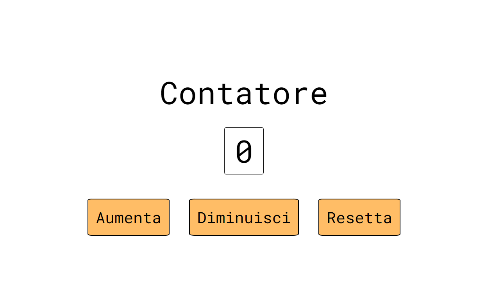

# Contatore 

L'applicazione che ti aiuta a portare i conti. 

[Prova la demo](https://antonio-naccarella.github.io/Counter/)

## :question: About
 

Un semplice progetto, il mio primo approccio a JavaScript, sviluppato per il corso "JavaScript basics" di [Start2Impact University](https://talent.start2impact.it/). 
L'applicazione è un contatore, mostra sul display una cifra che può essere aumentata e diminuita di 1, o essere resettata a 0, cliccando sull' apposito bottone.
## :books: Languages
* HTML
* CSS
* JavaScript
## :e-mail: Contacts
Puoi trovarmi qui:
* [Linkedin](https://www.linkedin.com/in/antonio-naccarella-31976725a/)
* E-mail: naccarellaantonio25@gmail.com

