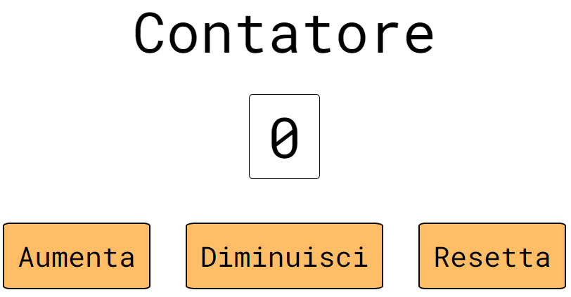

  

  <h1 align="center">Contatore</h1>

  

   L'applicazione che ti aiuta a portare i conti.
  

   
  <a href="https://antonio-naccarella.github.io/Counter/">Prova la demo!</a>

Un semplice progetto, il mio primo approccio a JavaScript, sviluppato per il corso "JavaScript basics" di Start2Impact.

L'applicazione è un contatore, mostra su un display una cifra che può essere aumentata e diminuita di 1, o essere risettata a 0, cliccando sull' apposito bottone.

